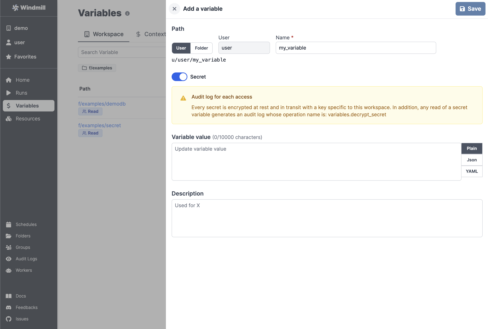

# Variables and Secrets

When writing scripts, you may want to reuse variables, or safely pass secrets to
scripts. You can do that with **Variables**. Windmill has user-defined variables
and contextual variables.

Variables are dynamic values that have a key associated to them and can be retrieved during the execution of a Script or Flow.

All Variables (not just secrets) are encrypted with a workspace specific symmetric key to avoid leakage.

There are two types of Variables in Windmill: user-defined and contextual.

## User-defined Variables

User-defined Variables is essentially a key-value store where every user can
read, set and share values at given keys as long as they have the privilege to
do so.

They are editable in the UI and also readable if they are not
Secret Variables.

Inside the Scripts, one would use the Windmill client to interact with the
user-defined Variables.

Python:

```python
import wmill

wmill.get_variable("u/user/foo")
wmill.set_variable("u/user/foo", value)
```

TypeScript (Deno):

```typescript
import { getVariable, setVariable } from 'https://deno.land/x/windmill@v1.101.1/mod.ts';

getVariable('u/user/foo');
setVariable('u/user/foo', value);
```

Note that there is a similar API for getting and setting [Resources](../3_resources_and_types/index.md)
which are simply Variables that can contain any JSON values, not just a string
and that are labeled with a [Resource Type](../3_resources_and_types/index.md#create-a-resource-type) to be automatically
discriminated in the auto-generated form to be of the proper type (e.g. a
parameter in TypeScript of type `pg: Postgresql` is only going to
offer a selection over the resources of type postgresql in the auto-generated UI).

There is also a concept of [state](../../reference/index.md#state-and-internal-state) to share values
across script executions.

## Contextual variables

Contextual Variables are variables whose values are contextual to the Script
execution. They are are automatically set by Windmill. This is how the Deno and Python clients get their implicit
credentials to interact with the platform.

See the `Contextual` tab on the <a href="https://app.windmill.dev/variables" rel="nofollow">Variable page</a> for the list of reserved variables and what they are used for.

You can use them in a Script by clicking on "+Context Var":


| Name                 | Value                                                                                                               |
| -------------------- | ------------------------------------------------------------------------------------------------------------------- |
| `WM_WORKSPACE`       | Workspace id of the current script                                                                                  |
| `WM_TOKEN`           | Token ephemeral to the current script with equal permission to the permission of the run (Usable as a bearer token) |
| `WM_EMAIL`           | Email of the user that executed the current script                                                                  |
| `WM_USERNAME`        | Username of the user that executed the current script                                                               |
| `WM_BASE_URL`        | Base URL of this instance                                                                                           |
| `WM_JOB_ID`          | Job id of the current script                                                                                        |
| `WM_JOB_PATH`        | Path of the script or flow being run if any                                                                         |
| `WM_FLOW_JOB_ID`     | Job id of the encapsulating flow if the job is a flow step                                                          |
| `WM_FLOW_PATH`       | Path of the encapsulating flow if the job is a flow step                                                            |
| `WM_SCHEDULE_PATH`   | Path of the schedule if the job of the step or encapsulating step has been triggered by a schedule                  |
| `WM_PERMISSIONED_AS` | Fully Qualified (u/g) owner name of executor of the job                                                             |
| `WM_STATE_PATH`      | State resource path unique to a script and its trigger                                                              |

## Secrets

Secrets are encrypted when stored on Windmill. From a usage standpoint, secrets
are kept safe in three different ways:

- Secrets can only be accessed by **users with the right permissions**, as defined
  by their path. In addition, secrets can be explicitly shared with users or
  groups. A secret in `u/alice/secret` will only be accessible by `alice`,
  unless explicitly shared. A secret in `f/devops/secret` will be accessible by anyone with read access to `f/devops`.
- Secrets **cannot be viewed outside of scripts**. Note that a user could still
  `print` a secret if they have access to it from a script.
- Accessing secrets generates `variables.decrypt_secret` event that ends up in
  the <a href="https://app.windmill.dev/audit_logs" rel="nofollow">Audit Logs</a>. It means that **you can audit who accesses secrets**. Additionally you can audit results, logs and
  script code for every script run.

## Add a Variable or Secret

You can define variables from the **Variables** page. Like all objects in
Windmill, variable ownership is defined by the **path** - see
[ownership path prefix](../../reference/index.md#owner).

Variables also have a **name**, generated from the path, and names are used to
access variables from scripts.

A variable can be made **secret**. In this case, its value will not be visible outside of a script.

<!-- - see [secrets security note](#secrets-security-note). -->



## Accessing a variable from a script

### Contextual variables

Reserved variables are passed to the job as environment variables. For example, the ephemeral token is passed as `WM_TOKEN`.

### User-defined variables

There are 2 main ways variables are used within scripts:

1. Passing variables as parameters to scripts.

   Variables can be easily passed as parameters of the script, using the UI based variable picker. Underneath, the variable is passed as a string of the form: `$var:<variable_path>` and replaced by the worker at time of execution of the script by fetching the value with the job's permissions. So the job will fail if the job's permissions inherited from the caller do not allow access to the variable. This is the same mechanism used for resource, but they use `$res:` instead of `$var:`.

2. Fetching them from within a script by using the wmill client in the respective language.

#### Fetching a variable in Typescript

```typescript
wmill.getVariable('u/user/foo');
```

### Fetching a variable in Python

```python
wmill.get_variable("u/user/foo")
```

### Fetching a variable in Go

```go
wmill.GetVariable("u/user/foo")
```

### Fetching a variable in Bash

```bash
curl -s -H "Authorization: Bearer $WM_TOKEN" \
  "$BASE_INTERNAL_URL/api/w/$WM_WORKSPACE/variables/get/u/user/foo" \
    | jq -r .value
```

The last example is in bash and showcase well how it works under the hood: It fetches the secret from the API using the job's permissions through the ephemeral token passed as environment variable to the job.
