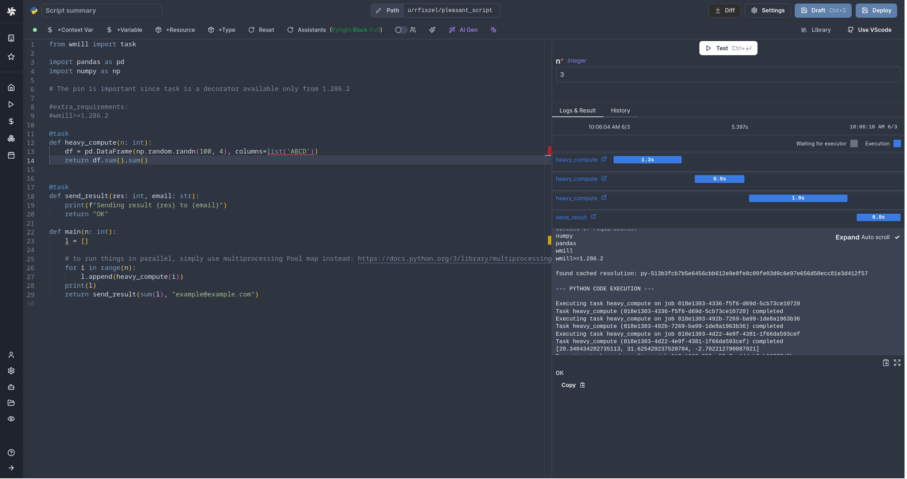

# Workflows as code



Flows are not the only way to write distributed programs that execute distinct jobs. Another approach is to write a program that defines the jobs and their dependencies, and then execute that program. This is known as workflows as code.

One way of doing this is to use the API of windmill itself, to run jobs imperatively, using run_script and run_flow (their sync or async counterparts). This is a powerful way to define workflows, but it can be complex and verbose.

It also require to define the different jobs in different scripts. This is why, Windmill supports to define workflows as code in a single script in both Python and Typescript using intuitive and lightweight syntax.

The syntax is highlighted in the below examples, note that the subtask are indeed executed as distinct jobs, with their own logs, and their relationship with their parent task is recorded which allow for the timeline of each task to be displayed in the UI.

To have some steps refer to other scripts and flows not in this file, use the normal functions `run_script` from the windmill SDK. The script below is a normal script and does not need special consideration. As such, it will already work with all the features of normal script and can be synced with the git and the CLI.

</TabItem>
<TabItem value="python" label="Python" attributes={{className: "text-xs p-4 !mt-0 !ml-0"}}>

```python
from wmill import task

import pandas as pd
import numpy as np

# The pin is important since task is a decorator available only from 1.286.2

#extra_requirements:
#wmill>=1.286.2


##You can specify tag to run the task on a specific type of worker
@task(tag="highmem")
def heavy_compute(n: int):
    df = pd.DataFrame(np.random.randn(100, 4), columns=list('ABCD'))
    return df.sum().sum()


@task
def send_result(res: int, email: str):
    # logs of the subtask are available in the main task logs
    print(f"Sending result {res} to {email}")
    return "OK"

def main(n: int):
    l = []

    # to run things in parallel, simply use multiprocessing Pool map instead: https://docs.python.org/3/library/multiprocessing.html
    for i in range(n):
        l.append(heavy_compute(i))
    print(l)
    return send_result(sum(l), "example@example.com")

```

</TabItem>
<TabItem value="deno" label="TypeScript (Bun)" attributes={{className: "text-xs p-4 !mt-0 !ml-0"}}>

```typescript
import { task } from 'windmill-client';

export async function hello(name: string) {
	return 'Hello:' + name;
}

export async function main() {
	//It's the function itself that needs to be wrapped with task, and it's always a promise even
	await task(hello)('BAR');
	return await task(hello)('FOO');
}
```

</TabItem>
</Tabs>
