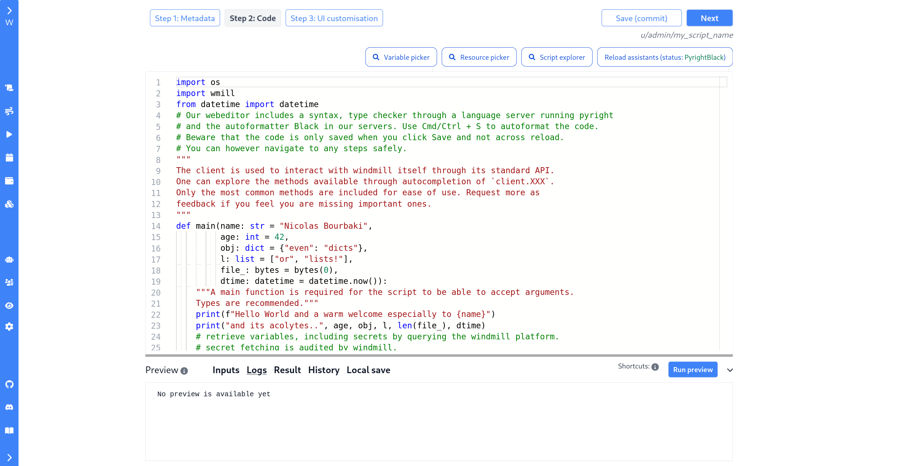
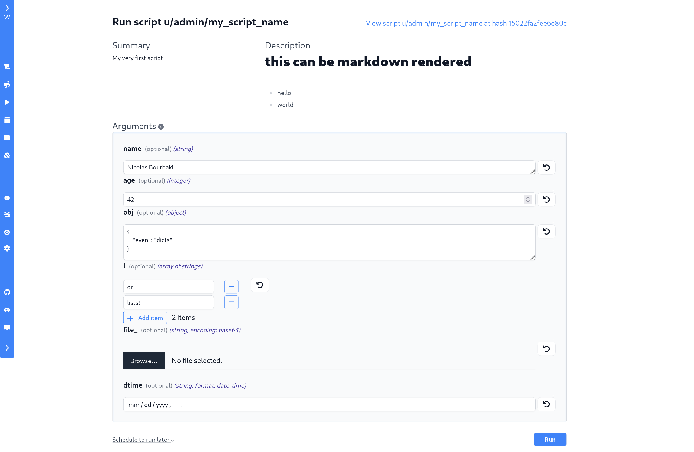

# Scripts

In this tutorial, you will create a basic Hello world script, and understand
some of Windmill's main concepts: scripts, accepting user input, and runs. 

Scripts can act as standalone apps, but can also be chained together to 
create *flows*.

We will cover flows in a [separate intro][flows]. In there, we will see
that in flows, while some of the steps are custom business logics from
your workspace or inlined directly into the flow, most of the steps are generic
scripts made by the community in the [WindmillHub](https://hub.windmill.dev). 
Once a script gets approved by WindmillHub moderators, it becomes available
to be used directly from the flow builder.

## Step 1: Login

Log into your windmill instance. You will land on the dashboard.

## Step 2: Create a script

Use the **Add script** button to create a new script. It will open the create
page, with three sections:

### Metadata

The **metadata section** contains information useful to the script's users:

- **path:** a unique identifier that consist of the script owner, and the script
  name. The path has an [ownership path prefix](../reference#owner). Select
  `user` (that means the script is private) and `hello` as your script's name.
- **language** chose between python or typescript (deno)
- **summary:** a short summary of what the script does, that will be displayed
  on the dashboard. Make it clear and short so that your users know what this
  script is for: `Say hello to someone`.
- **description:** instructions or details on how to run the script, and what it
  does. Let's use `provide a username, and this script will greet them`.

### Code

Let's move on to the **code** page. This is where we will write the script. In
Windmill, scripts need to have a `main` function that will be the script
entrypoint and the parameters of the main function are used to compute the input
spec of that script. That input spec will be used for both generating the
frontend form that you see when using that script as a standalone app, and for
the inputs that it takes when that script is a step of a flow.

- The **code editor** is preloaded by default with a script: let's go through
  it. Every script in Windmill needs to have a **main** function that will be
  called at runtime. Even in python, it is extremely recommended to add type
  annotations to that main function: Windmill can infer arguments from the
  main's function signature.

Write and edit your typescript code in a powerful webeditor with autocompletion
and type inference.

It works with Python too.

Windmill parses the main function signature, infers argument names and types.

All set! Save your work, and you'll land on the script page. Note that scripts
are [versioned](../reference#versioning), and each new edit creates a new script
version.

### Step 3: Run!

Now let's look at what users of this script will do. Click on the **run** button
to run this script. You'll see the user input form we defined earlier. Note what
happens if you don't provide input:

Fill in the fields, then hit run. You should see a run view, as well as your
logs. All script runs are also available in the **Runs** menu on the left.

This script is a minimal working example, but there's a few more steps we need
in a real-world use case:

- Pass [variables and secrets](../how-tos/variables_and_secrets) to a script
- Connect to [resources](../how-tos/create_resources)
- Run scripts or flows on a [schedule](../how-tos/schedule)
- Compose scripts in [flows][flows]

<!-- Resources -->
[flows]: ./flows
