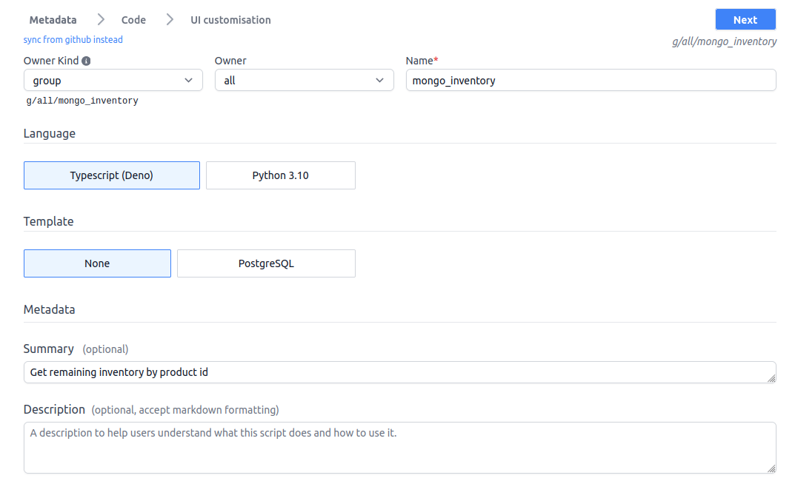
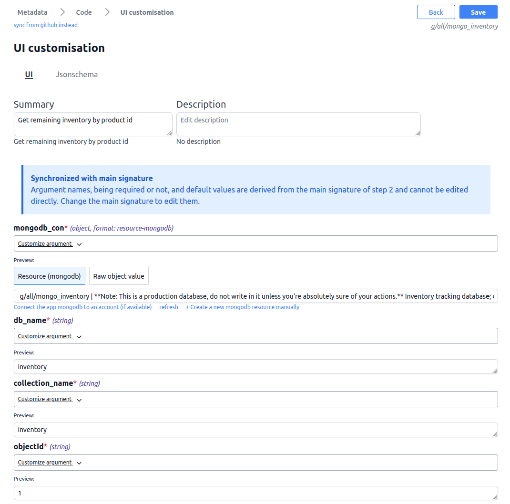

# MongoDB

## Getting started

We will see how to connect your Windmill instance to an external MongoDB 
database, then use it in scripts.

## Create Resource

We need to define a `mongodb` [*Resource*][docs-resources]. 

Windmill provides integration with multiple different services and apps.
We call them *Resources Types*, and offer integrations with databases, 
enterprise chat platforms or code versioning systems, to name a few. 

You can also define your own types, but that will be covered in a different 
section.

Head to the Resources tab and click on "Add a resource" button in the top 
right corner.

Next we need to define the metadata. 

**Path** is the unique identifier on the platform. It defines 
the visibility scopes and ownership. For more information check the 
[reference documentation][docs-path].

For this example we want to create a resource shareable to all the users
of our workspace:

- For **Owner Kind**, choose `group`, allowing everyone in that group to access
the resource
- **Owner** should be `all`, for the aforementioned reasons
- Since we're creating an inventory database resource, let's **Name** it
`pg_inventory`.
- **Description**, while not obligatory, is always a good idea. You can include
any and all information to users of the resource. Let's put a warning that
this is a production database, and users should be weary about their actions.
- **Resource type** is `mongodb`.

:::tip
You can use Markdown formatting in the **Description** field.
:::

Once the metadata defined, click the "Next" button to fill the connection
details. 

Fill in your connection details, and click "Save" to create the resource.

:::tip
If you ever have any doubt about the format of fields in pre-defined
resources, you can see the full schema by clicking on a Resource Type and 
switching to 'advanced' tab
:::

Once created, it can be seen in the *Resources* [section][wm-app-resources].

Congratulations, you have just created a shared MongoDB database resource!

## Create Script

Next, let's create a Script that will use the newly created resource.

Head on to the Script tab and click on the "New Script" button.

We will be using a TypeScript/Deno as language

Let's add the Script's code:

:::tip
You can specify default values for parameters, they will automatically be 
used in the next step
:::

Click Next to move on to the UI Customization step.

Here we can customize the UI of the Script, give parameters descriptions, and
default values. 

From the dropdown menu, you can select the database we created in 
previous step. Note you can see the description you provided in the previous
step.

Once you're done, click on Save to save the Script to your workspace. 
You can now use the created Script in your Flows, or as standalone.

<!-- Links -->

[wm-app-resources]: https://app.windmill.dev/resources
[docs-resources]: ../reference#resource
[docs-path]: ../reference#path